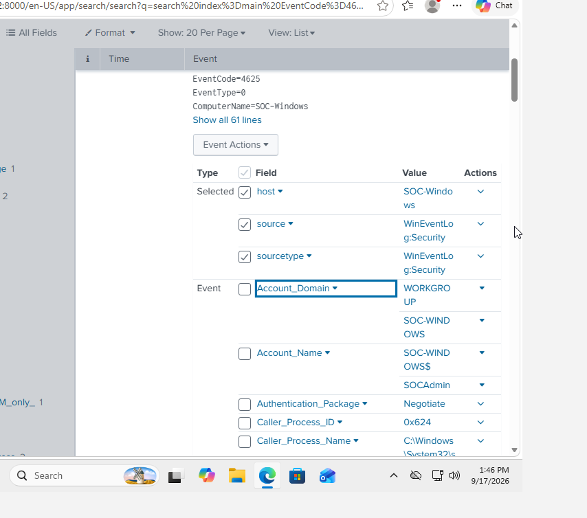
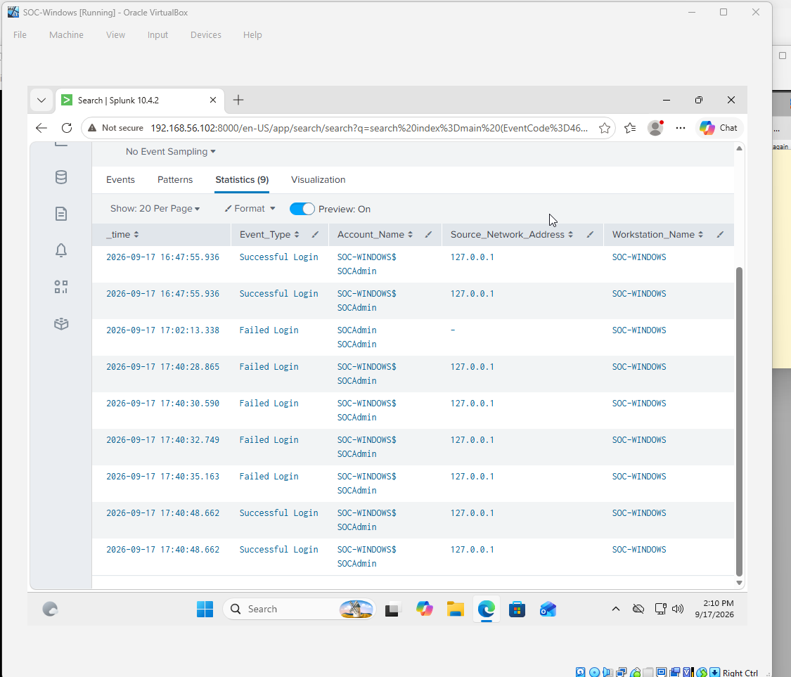
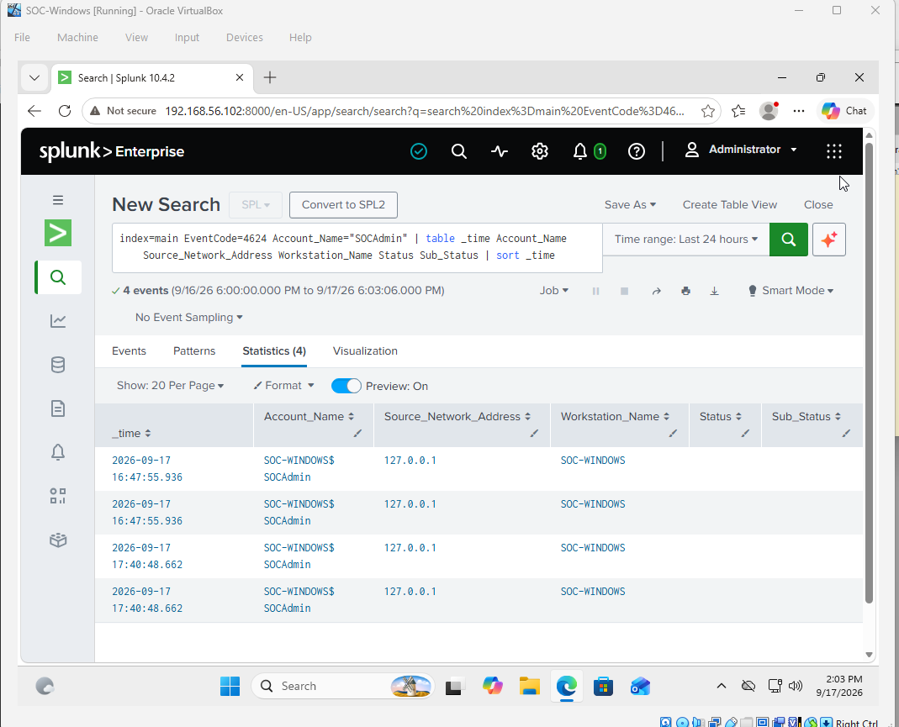

# Windows Authentication Investigation

## Overview

This project demonstrates a Windows authentication investigation using
Splunk Enterprise and Windows Security Event Logs.

The investigation focuses on identifying failed authentication attempts,
analyzing authentication details, and correlating failed logons with
subsequent successful logons.

## Lab Environment

- Windows 11
- Splunk Enterprise 10.4.2
- Splunk Universal Forwarder 10.4.2
- Ubuntu 24.04 LTS
- Oracle VirtualBox
- Windows Security Event Logs
- Splunk Search Processing Language (SPL)

## Investigation Objective

Investigate repeated Windows authentication failures and determine whether
the activity indicates suspicious behavior.

## Investigation Process

1. Collected Windows Security Event Logs using the Splunk Universal Forwarder.
2. Searched Splunk for Event ID 4625 failed logons.
3. Analyzed affected accounts and authentication details.
4. Examined the source network address and workstation.
5. Investigated Event ID 4624 successful logons.
6. Correlated failed and successful authentication events.
7. Documented the investigation findings.

## Key Events

### Event ID 4625 — Failed Logon

Event ID 4625 was used to identify failed authentication attempts.

### Event ID 4624 — Successful Logon

Event ID 4624 was used to identify successful authentication following
the failed attempts.

## Findings

Five Event ID 4625 records were identified during the investigation period.

The activity involved the SOCAdmin account and the SOC-WINDOWS workstation.
Where a source address was recorded, the source was 127.0.0.1, indicating
the local system.

The failed authentication events included Sub-Status 0xC000006A, which
corresponds to an incorrect password.

A subsequent successful authentication was identified after the failed
authentication attempts.

Because the activity was intentionally generated as part of a controlled
lab exercise, the evidence does not establish an external brute-force
attack.

## Investigation Timeline

| Time | Event | Source | Workstation |
|---|---|---|---|
| 17:02:13 | Failed Login | Local/unspecified | SOC-WINDOWS |
| 17:40:28 | Failed Login | 127.0.0.1 | SOC-WINDOWS |
| 17:40:30 | Failed Login | 127.0.0.1 | SOC-WINDOWS |
| 17:40:32 | Failed Login | 127.0.0.1 | SOC-WINDOWS |
| 17:40:35 | Failed Login | 127.0.0.1 | SOC-WINDOWS |
| 17:40:48 | Successful Login | 127.0.0.1 | SOC-WINDOWS |

## Recommended SOC Response

In a production environment, a SOC analyst could:

- Validate whether the successful authentication was authorized.
- Investigate the source of the authentication attempts.
- Review surrounding Windows Security events.
- Determine whether additional account protections are necessary.
- Continue monitoring for repeated authentication failures.

## Skills Demonstrated

- Splunk Enterprise
- SPL
- Windows Security Event Logs
- Event ID analysis
- Authentication investigation
- Log analysis
- Timeline creation
- Incident documentation
- Basic SOC investigation methodology

## Project Files

- `incident-report.md` — Detailed investigation report
- `spl-queries.txt` — SPL queries used during the investigation
- `screenshots/` — Investigation evidence and Splunk screenshots

## Investigation Evidence

### Failed Login Events

The following screenshot shows Windows Event ID 4625 records identified in Splunk.

### Failed Login Analysis

This screenshot shows the extracted account information from the failed authentication events.

### Failed Login Event Details

This screenshot shows authentication details including the source network address,
status, and sub-status values.

### Authentication Timeline

The following timeline correlates failed and successful authentication events.

### Successful Login Events

This screenshot shows Event ID 4624 successful authentication events.

